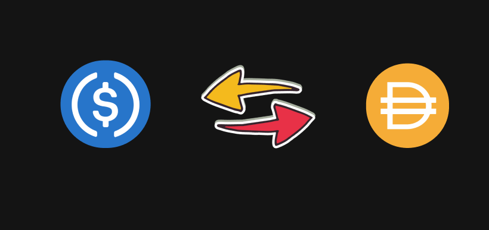

Swapping in DeFi is like exchanging one type of crypto assets for another, similar to exchanging money when you travel to a foreign country.
 

Imagine Alice has 10 USDC tokens, and she wants to get some DAI. She can do so by using a decentralized exchange (DEX) platform like Uniswap or SushiSwap, where she can swap her 10 USDC for an equivalent amount of DAI. It's like trading dollars for euros at a currency exchange booth.

